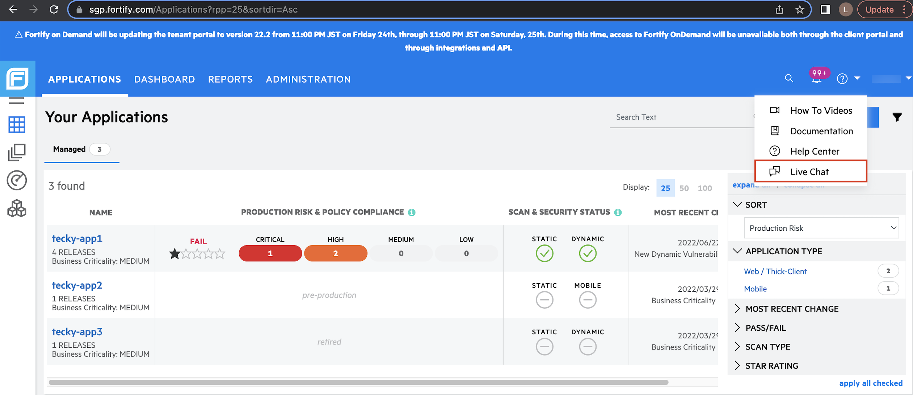

# Additional Resources

- [Fortify on Demand Overview](https://www.youtube.com/watch?time_continue=11&v=3pqc-vSr0Yo&feature=emb_logo)
- [FOD Help Center](https://fodsgp.zendesk.com/hc/en-us)
- [FOD Documentation](https://sgp.fortify.com/Docs/en/index.htm)
- [FOD Live Chat](#fod-live-chat)

### FOD Live Chat

Live chat is useful for user-specific queries, such as checking the scan status of a release, feature requests, bug reporting, clarifications on how a particular feature work.

> **Note:** The live chat support engineer is a external SaaS support engineer, not a SHIP-HATS engineer. Please [raise a service request for SHIP-HATS related issues]().

**To access the live chat feature:**
1. Log in to the FOD Portal.
1. In the top-right corner, click **?**.
1. Click **Live Chat**.  
    A widget will popup at the bottom right hand corner of the screen.
1. When prompted for a **Tenant Code** to use the live chat feature, enter **GovTech**.

    