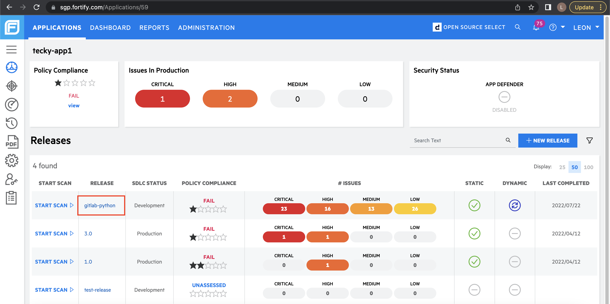
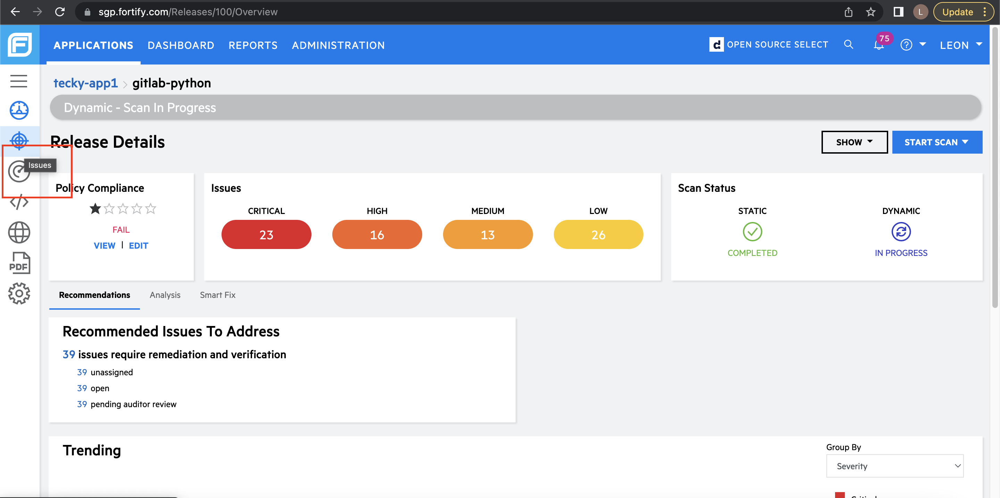
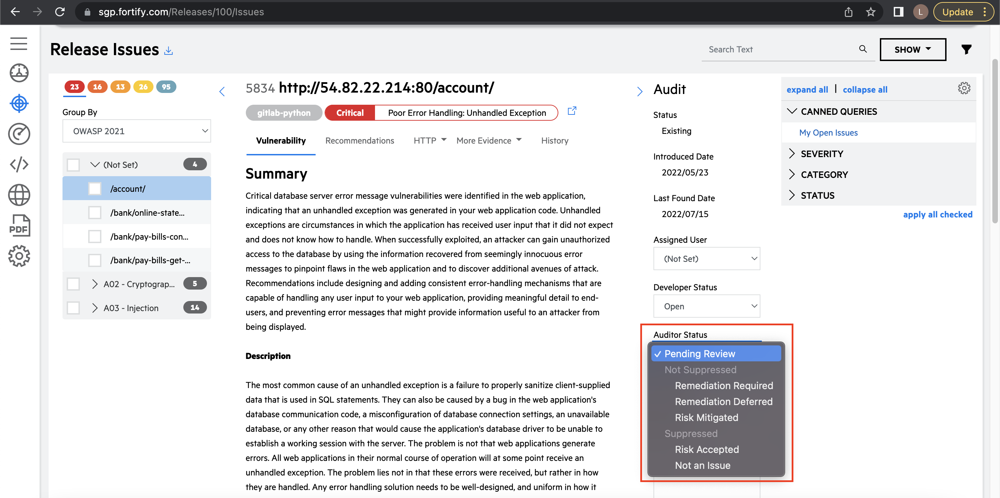

# View/Audit Issues 

1. Navigate to one of your applications in the [FOD Portal](https://sgp.fortify.com/).
1. Click one of the available **Release** to view the issues detected from your SAST/DAST scans. For this example, we are using gitlab-python release.

    

1. From the left sidebar, click the **Issues** tab.

    

    A list of issues for your release will appear. Under each issue, an auditor status attribute allows you to suppress the issue. Only GT-Security Lead and above are allowed to suppress issues.

    

