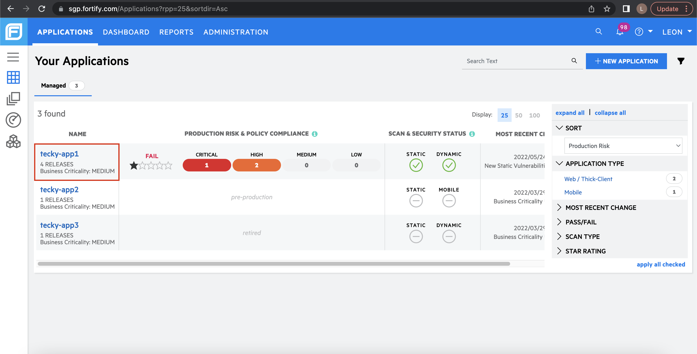
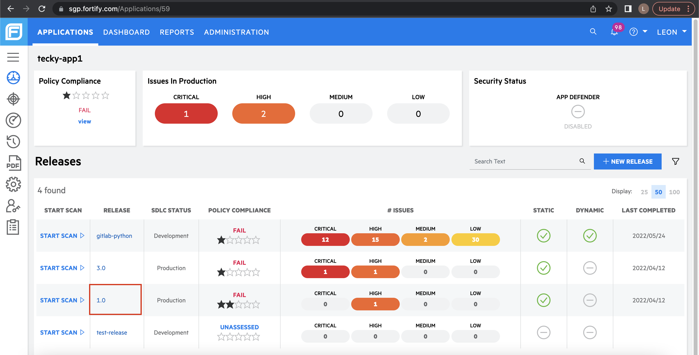
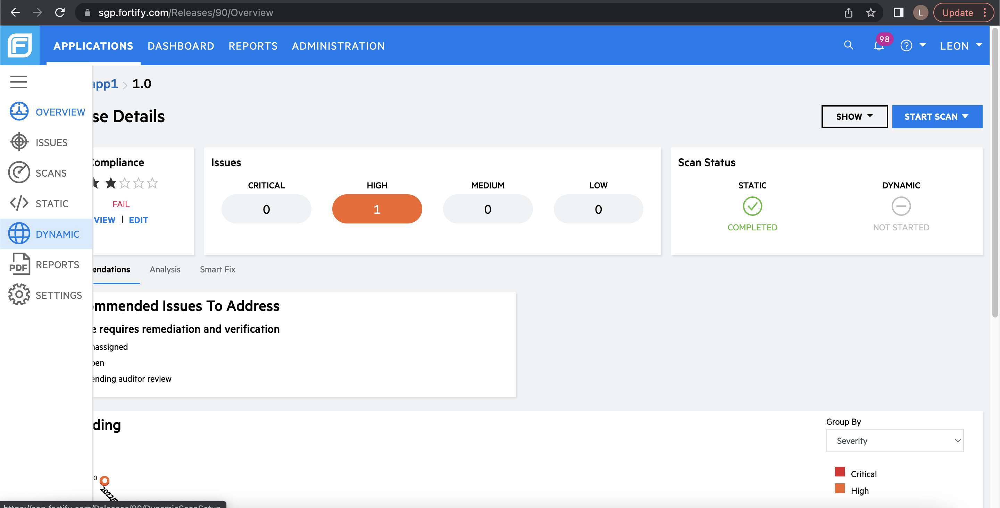
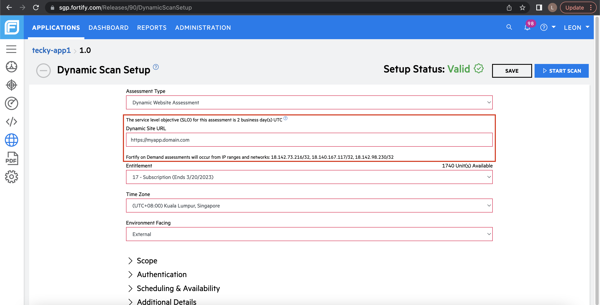
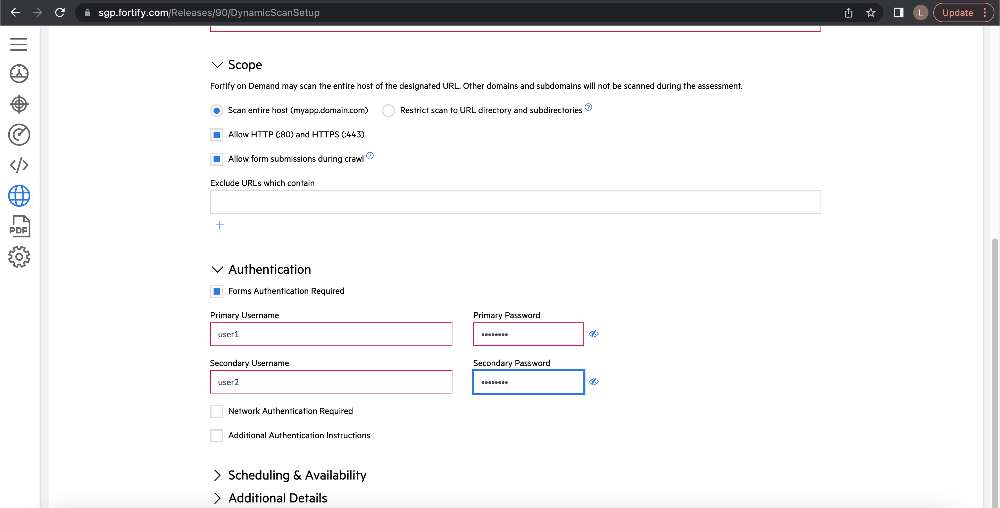
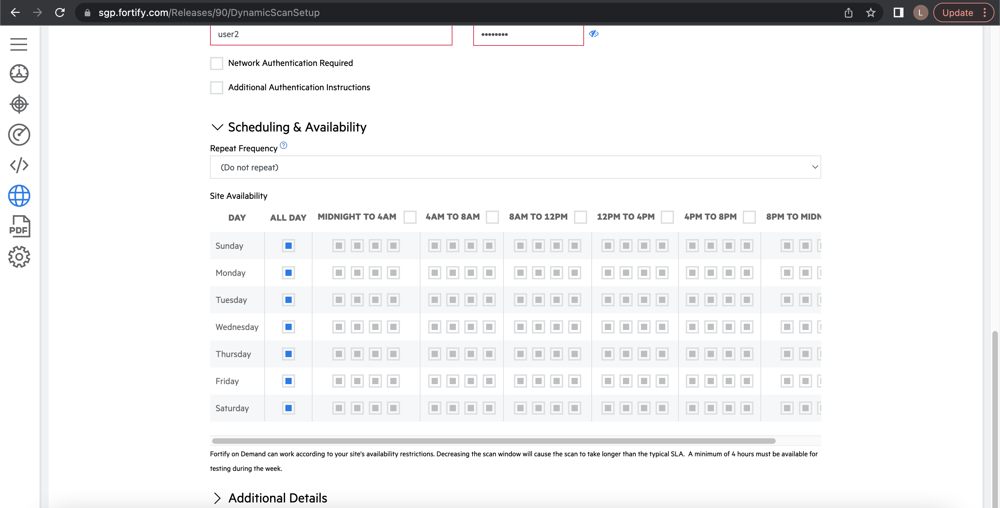
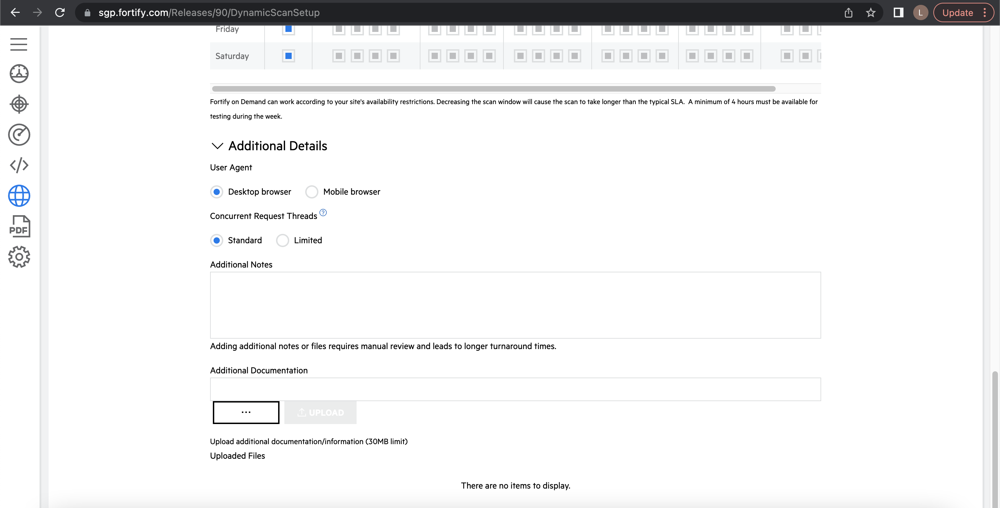
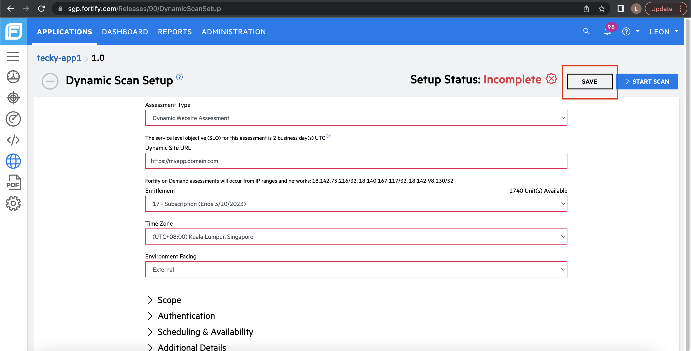
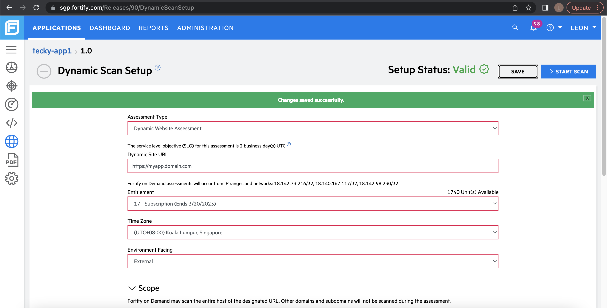

# DAST Scan

Complete the following steps to conduct a DAST scan:

1. [Retrieve FOD token](fod/fod-retrieve-information)
1. [Set up your DAST scan in FOD portal](#set-up-your-dast-scan-in-fod-portal)
1. [Run your DAST scan in GitLab](#run-your-dast-scan-in-gitlab)
1. [Generate DAST report on GitLab](#generate-dast-report-on-gitlab)

## Set up your DAST scan in FOD portal
Tenants are required to setup their DAST scan once in the [FOD Portal](https://www.sgp.fortify.com/) before running their DAST scan.

1. Log in to the [FOD Portal](https://www.sgp.fortify.com/), and then click application of your choice. For this example, we are using *tecky-app1*.

    

    You should be able to see at least one release in your application since the SHIP-HATS portal would have created the default 1.0 release for you. For this example, we will be using the 1.0 release.

    

1. Open the menu button on your left, and then select **Dynamic** to start configuring your DAST scan.
    
    

1. Fill in the **Dynamic Site URL**. 
    - Enter value in the **Dynamic Site UR**L as the *IP/DNS name of your application*. 
    - Make sure that your application is public facing. 
    - Whitelist the following IP ranges: 
        - ```18.142.73.216/32```
        - ```18.140.167.117/32```
        - ```18.142.98.230/32```
    - Few of the fields are already populated. Do **not** change those. 

    

1. Under **Scope**, you can choose to restrict your scan to a few URL directories. For this example, we will scan the entire host and will not exclude any URL. 

1. Under **Authentication**, enter two sets of credentials. These are required if your web app is protected by a login page. 
    
    

1. Under **Scheduling & Availability**, set the **Repeat Frequency** to configure how often the DAST scan should occur. Instead of setting an interval for the repeat frequency, we recommend to use the CI way to trigger the DAST scan on demand.

    

    The **Site availability** allows you to configure your site's uptime so that the DAST scan will only occur during the times you specify. However, we strongly recommend you keep your pre-filled values since it will increase the scan times in an event where your site is unavailable when the DAST scan is ready to scan your application.

1. Under **Additional Details**, you can change the **User Agent** and **Concurrent Request Threads**. You can also upload **Additional Documentation** to provide a customized use case of your scan. 
    
    We recommend that you keep the pre-filled values as they are, unless you have a very specific use case to use a mobile browser.
    
    

1. Scroll to the top to **Save** your DAST setup.
    
    

    Your **Setup Status** is now **Valid** and changes are saved successfully. You are now ready to invoke your DAST scan via GitLab.
    
    


## Run your DAST scan in GitLab

After you have [set up your DAST scan in FOD](#set-up-your-dast-scan-in-fod-portal), use this [GitLab template](https://gts.gitlab-dedicated.systems/templates/ship-hats-templates/-/blob/main/templates/.gitlab-ci-run-fod-dast.yml) to perform your scan.

Running the scan performs following three essential steps to run your scan successfully:

- Get API token to invoke scan.
- Get assessment ID from your DAST scan template, which was set up in previous step.
- Run scan using predefined and custom variables.

> **Note:** FOD DAST scans are asynchronous. This means that the CI job will only queue the scan to the existing scan queue, it will take some time before the scan result is returned. For more information, refer to the [FOD Service Level Objectives](fod/fod-slo) documentation.

For more information, refer to following resources:
- [Our GitLab template guide](https://gts.gitlab-dedicated.systems/templates/ship-hats-templates/-/tree/main/templates#file-gitlab-ci-run-fod-dastyml).
- [Sample log of what you will see for a successful pipeline](https://gts.gitlab-dedicated.systems/templates/ship-hats-templates/-/jobs/42363).

## Generate DAST report on GitLab

To ensure that no False Positive (FP) appears in the [GitLab Vulnerability Dashboard](https://docs.gitlab.com/ee/user/application_security/security_dashboard/), we recommend that you perform a manual review on the issues found from the DAST scan before generating a DAST report on GitLab. 

For information on how to reuse the template, refer to [GitLab Template Guide](https://gts.gitlab-dedicated.systems/templates/ship-hats-templates/-/tree/main/templates#file-gitlab-ci-create-fod-reportyml).

<!-- as per confluence - TODO: Add screenshot of Gitlab Vulnerability Dashboard -->

## DAST Limitations

The following list provides FOD limitations:

- You cannot change Dynamic Site URL, Scope, and Authentication values in the DAST setup after a DAST scan has been started on a release. <!--Previously in WIE, users are able to whitelist site URLs and start new scans with different whitelisted URLs. Users are also able to use different login macros.-->
- You cannot change the URL or user credentials after a scan has started. Therefore, you must verify that the URL is valid before starting a DAST scan.
- You must use DNS names instead of IP to scan your app as IPs might change, causing the DAST scan to fail because the app is no longer hosted on that IP. <!--In the worst case scenario, users will have to delete the release and recreate in order to create a new DAST setup.-->
- For each application in FOD, only one DAST scan can be performed at any time.	<!--Previously in WIE, users are able to trigger multiple DAST scans which are queued and handled based on the availability of sensors hosted in the SHIP-HATS environment.-->
- FOD does not allow new DAST scans to be triggered on an application release if an existing scan is running on another release of the same application. 
    - For example, if application A has 2 releases (1.0 and 2.0). A DAST scan cannot be triggered on release 2.0 if there is an existing scan running on release 1.0. This does not affect releases from different applications, which means that release 1.0 of application B can will proceed to scan even if application A already has a scan running.
    - Use CI to control when your scans are conducted. Do not schedule your scan as mentioned in [Step 6 of Set up your DAST scan in FOD portal](#set-up-your-dast-scan-in-fod-portal). For projects with multiple applications, we strongly recommend that you create one FOD application per web app to prevent this issue from affecting your release management.
- DAST scans might take more than 1 day when the first scan is invoked. The first DAST scan of each release is manually audited by the SaaS operations team. This might significantly increase the scan times when your first scan is invoked. However, future scans will not take more than a few hours, based on the complexity of your application.

