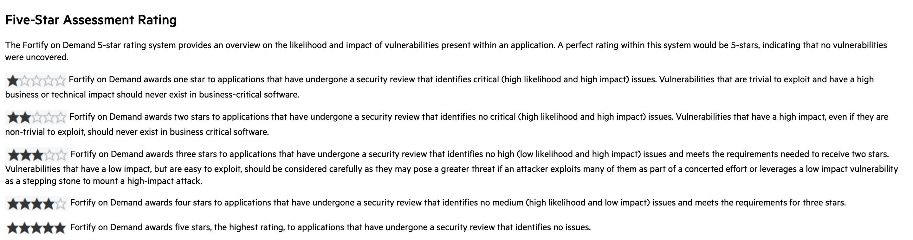
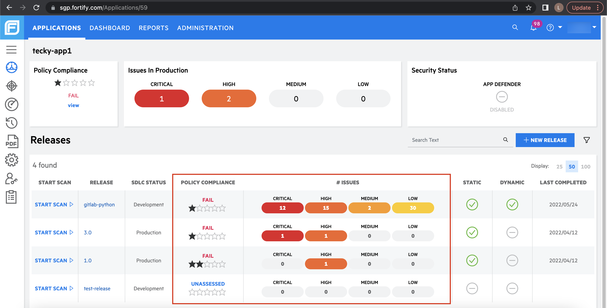

# Production Risk & Policy Compliance

FOD introduces a system-wide policy that shows the severity of the findings for all FOD applications and their releases.

- **Five-star assessment rating:** Releases are awarded 1-5 stars based on whether any CRITICAL, HIGH, MEDIUM, or LOW findings are found.

    

- **Security Policy:** Govtech Security Policy uses **System Default Policy**. The details of the security policy are shown below, where Star Rating of the releases must be at least 3 Stars. This means that releases with HIGH issue(s) and above will fail.

    

- **Policy Compliance:** Release that failed the security policy will have their **Policy Compliance** set to FAIL. This means that there are HIGH and above findings in that particular release.

    
