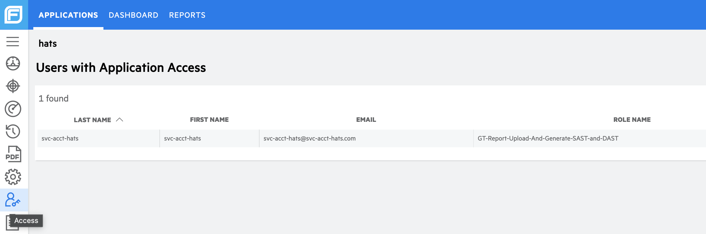

# Retrieve FOD information

Only SA/PA can get the details of FOD application. Please contact your PA to retrieve the following:
- [FOD token ID](#retrieve-fod-token) 
- [FOD release number](#retrieve-fod-release-number) 
- [FOD service account](#retrieve-fod-service-account) 

## Retrieve FOD token

Refer to the [Retrieve token](https://docs.developer.tech.gov.sg/docs/ship-hats-portal/manage-tokens) section in the [Portal](https://docs.developer.tech.gov.sg/docs/ship-hats-portal/) documentation.

## Retrieve FOD release number

1. Get FOD release number from the FOD URL as shown in the image below.     
    For example, if the URL is https://sgp.fortify.com/Release/100/Overview, the **release number** is *100*.
    
    

## Retrieve FOD service account

1. Navigate to to the [FOD portal](https://sgp.fortify.com/) > Your application > **Access**, and then search for `svc-acct`.  
    The service account will be the first part of the email before `@`. For example, if the email address is `svc-acct-hats@svc-acct-hats.com`, the **service account** is `svc-acct-hats`.

    