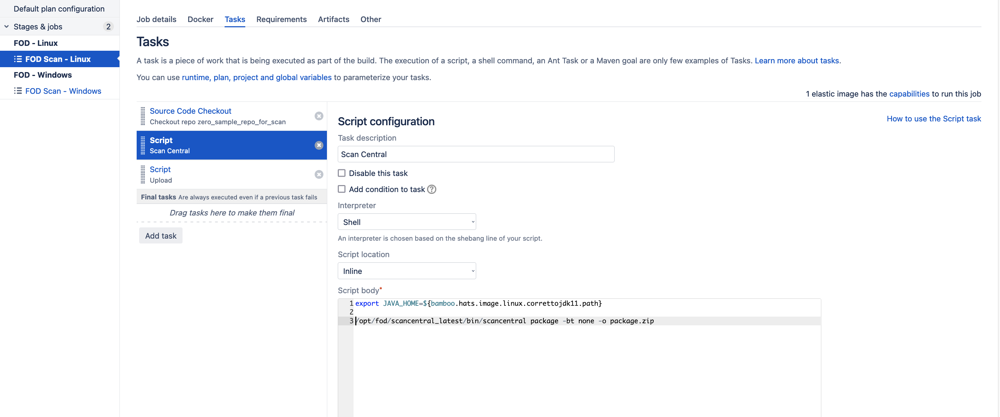

# SAST Scan using Bamboo


Complete the following steps to conduct a SAST scan using Bamboo:

1. [Prerequisites](#prerequisites)
1. [Package source code in ZIP file](#package-source-code-in-zip-file)
1. [Upload ZIP to FOD server for processing and scanning](#upload-zip-to-fod-server-for-processing-and-scanning)

<!--1. [Generate report based on scan results](#generate-report-based-on-scan-results)-->

## Sample Bamboo plans for SAST scans

Two types of plans are provided:
- Bamboo plan for MSBuild (.net framework). This plan utilises the Windows elastic image (hats_windows_image).
- Language agnostic Bamboo plan. This plan supports languages such as Python, Ruby, etc., and utilises the Linux elastic image (hats_linux_image).


>**Notes:**
>- Copying and pasting the commands for packaging and uploading (as described in [Package source code in ZIP file](#package-source-code-in-zip-file) and [Upload ZIP to FOD server for processing and scanning](#upload-zip-to-fod-server-for-processing-and-scanning) below) directly to bamboo might cause an issue with the formatting. We recommend that you delete all the dash signs `-`, and then manually enter them (via keyboard input) to ensure no formatting issue.
>- For each application, there can only be 1 concurrent scan. Therefore, we have set the default action to queue (FOD_IN_PROGRESS_SCAN_ACTION=-pp 2) if there are multiple scans occurring within the same application (either from the same release or different releases). If you want to override the value, refer to the [GitLab Upload Utility Tool](https://github.com/fod-dev/fod-uploader-java) for more information.
>- Only service account can perform scans as it will have the role `GT-Report-Upload-And-Generate-SAST-and-DAST`.


## Prerequisites

1. Get FOD release number from the URL (for e.g. the release number = 100)
    
    
1. PA/SA to [retrieve the FOD token (Personal Access Token)](https://docs.developer.tech.gov.sg/docs/ship-hats-portal/manage-tokens) from the [SHIP-HATS portal](https://www.ship.gov.sg/). 
1. PA/SA to get the FOD service account from the [FOD portal](https://sgp.fortify.com/).
    1. Navigate to to the FOD Portal > Your application > Access, and then search for `svc-acct`. The service account will be the first part of the email before `@`. In the example below, the service account is `svc-acct-hats`.

    
1. Configure the token and service account in bamboo variables.

    
1. Create 3 tasks:
    - To checkout code repository
    - For FOD scan central
    - For FOD upload  
    
    You can set your requirements to **hats_linux_image** or **hats_windows_image** according to your needs.

    


## Package source code in ZIP file


FOD uses `scancentral` to package the source code into a ZIP file. Previously, in Fortify SSC, we didn't need to package the source code since we are doing the translation and scanning in our CI server (Bamboo). However, for FOD, the translation and scanning will be done in the SaaS server. For more information, refer to the [FOD Documentation > Running Assessments > Static Assessments > Preparing Static Assessment Files](https://sgp.fortify.com/Docs/en/index.htm#Running_Asmnts/Static/StaticPrep/SP_FilePrep.htm?TocPath=Running%2520Assessments%257CStatic%2520Assessments%257CPreparing%2520Static%2520Assessment%2520Files%257C_____0).

Below are some examples on how to package your source code based on the programming language in use.

> **Note:** Packaging dependencies in your zip file will include your SAST scan duration. We recommend that you use Nexus IQ to scan your software dependencies.

|Objective|Command|
|---|---|
Create a package from a Gradle project |`scancentral.bat package -bt gradle -o package.zip`
Create a package from a Maven project with a custom pom.xml|	`scancentral.bat package -bt mvn -bf myCustomPom.xml -o package.zip` 
Create a package from an MSBuild project 	|`scancentral.bat package -bt msbuild -bf mySolution.sln -o package.zip` 
Create a package from a JavaScript/TypeScript project	|`scancentral.bat package -bt none - o package.zip` 
Create a package from a JavaScript/TypeScript project and include the node_modules <br> <br> **Caution:** This may greatly increase the package size as well as the scan time.|`scancentral.bat package -bt none - -scan-node-modules -o package.zip` 
Create a package from a Python 3 project	|`scancentral.bat package -bt none - yv 3 -pyr -o package.zip` 
Create a package from a Ruby project	|`scancentral.bat package -bt none - o package.zip` 
Create a package from a PHP 7.1 project	|`scancentral.bat package -bt none - hv 7.1 -o package.zip`
Create a package from other unlisted projects	|`scancentral.bat package -bt none - o package.zip`


### For hats_linux_image

```
export JAVA_HOME=${bamboo.hats.image.linux.correttojdk11.path}
 
/opt/fod/scancentral_latest/bin/scancentral package -bt none -o package.zip

```


### For hats_windows_image

```
set JAVA_HOME=${bamboo.hats.image.windows.correttojdk11.path}
 
C:\opt\fod\scancentral_latest\bin\scancentral package -bt none -o package.zip
```


## Upload ZIP to FOD server for processing and scanning
A utility tool (https://github.com/fod-dev/fod-uploader-java) is used to upload your ZIP file to the FOD server. 

Replace the **FOD_RELEASE** value with **your own FOD release** number which you have acquired in the [prerequisite step 1](#prerequisites).

Based on the table below, assuming you have a Python 3 project, your FOD_UPLOADER_OPTS should look something like this.

```
FOD_UPLOADER_OPTS: "-apf -ts 10 -l 18"
```

> **Note:** `-apf` is recommended since it will fail your build whenever your scan results fail the security policy set in FOD.

|Parameter|	Description|
|---|---|
-ts	|Technology stack as an integer: <br><br>1 (.NET), 23 (.Net Core), 2 (ABAP), 21 (Apex/Visualforce), 3 (ASP), 5 (CFML), 6 (COBOL), 22 (Go), 7 (JAVA/J2EE), 16 (JS/TS/HTML), 18 (MBS/C/C++/Scala), 9 (PHP), 10 (PYTHON), 17 (Ruby), 12 (Swift/Objective C/C++), 11 (VB6), 14 (VBScript)
-l	|Language level as an integer:<br><br>.NET: 2 (2.0), 3 (3.0), 4 (3.5), 5 (4.0), 11 (4.5), 15 (4.6), 16 (4.7), 30, (4.8), 32 (5.0)<br><br>.NET Core: 23 (1.0), 24 (1.1), 25 (2.0), 26 (2.1), 27 (2.2), 28 (3.0), 29 (3.1)<br><br>Java: 8 (1.5), 9 (1.6), 10 (1.7), 12 (1.8), 17 (1.9), 19 (10), 20 (11), 21 (12), 22 (13)<br><br>Python: 13 (2), 14 (2 Django), 18 (3)
-apf|	Whether to return exit(0) instead of exit(1) if the scan fails the security policy specified in Fortify on Demand

### hats_linux_image

For hats_linux_image, do **not** change the command except for the ones in `export`, your service account `${bamboo.fod_svc_acct}`, and token `${bamboo.fod_pat_not_password}` if you have set a different bamboo variable for  service account and token.

```
export FOD_NOTES="Triggered by Bamboo Plan IID ${bamboo.buildNumber}:${bamboo.buildResultsUrl}"
# refer to https://github.com/fod-dev/fod-uploader-java for FOD_UPLOADER_OPTS
export FOD_UPLOADER_OPTS="-apf -ts 10 -l 18"
export FOD_RELEASE="100"
export FOD_IN_PROGRESS_SCAN_ACTION="-pp 2"
 
 
java -jar /opt/fod/FodUpload.jar \
    -z package.zip -aurl ${bamboo.hats.fod.apiurl} \
    -purl ${bamboo.hats.fod.url} -rid $FOD_RELEASE \
    -tc ${bamboo.hats.fod.tenant} -uc ${bamboo.fod_svc_acct} ${bamboo.fod_pat_not_password} \
    -ep 2 $FOD_IN_PROGRESS_SCAN_ACTION -a 2 -eid 17 -at 3 \
    -I 1 $FOD_UPLOADER_OPTS -n "$FOD_NOTES"
```


### hats_windows_image

For hats_windows_image, do **not** change the command except for the ones in `export`, your service account `${bamboo.fod_svc_acct}`, and token `${bamboo.fod_pat_not_password}` if you have set a different bamboo variable for service account and token.

```
set FOD_NOTES="Triggered by Bamboo Plan IID ${bamboo.buildNumber}:${bamboo.buildResultsUrl}"
REM "refer to https://github.com/fod-dev/fod-uploader-java for FOD_UPLOADER_OPTS"
set "FOD_UPLOADER_OPTS=-apf -ts 10 -l 18"
set "FOD_RELEASE=100"
set "FOD_IN_PROGRESS_SCAN_ACTION=-pp 2"
 
 
java -jar C:\opt\fod\FodUpload.jar ^
    -z package.zip -aurl ${bamboo.hats.fod.apiurl} ^
    -purl ${bamboo.hats.fod.url} -rid %FOD_RELEASE% ^
    -tc ${bamboo.hats.fod.tenant} -uc ${bamboo.fod_svc_acct} ${bamboo.fod_pat_not_password} ^
    -ep 2 %FOD_IN_PROGRESS_SCAN_ACTION% -a 2 -eid 17 -at 3 ^
    -I 1 %FOD_UPLOADER_OPTS% -n %FOD_NOTES%
```


<!--
## Generate report based on scan results

After the scan is completed and your build passes, a report is automatically generated for your job. You can view the vulnerabilities under the **[GitLab Vulnerability Dashboard](https://docs.gitlab.com/ee/user/application_security/security_dashboard/)**.
-->