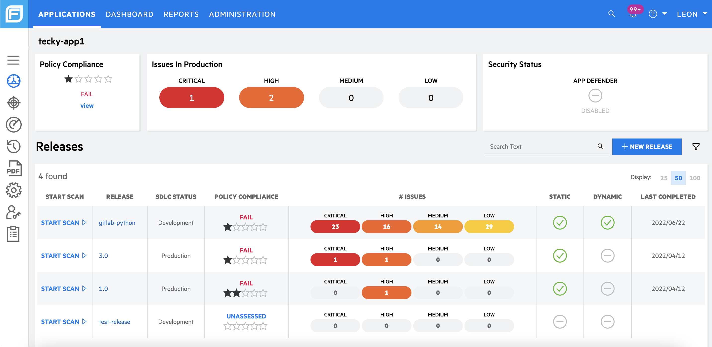

# View FOD Applications

<!--
You can view FOD applications via:
- [SHIP-HATS portal]()  
or
- [FOD Portal](#view-fod-applications-via-fod-portal)

### View FOD applications via FOD Portal
-->

1. Log in to the [FOD Portal](https://sgp.fortify.com/).  
    On your homepage, you can view a list of FOD applications. 
    > **Note:** You can create more FOD applications (subjected to subscription quota) using the SHIP-HATS portal.

    Each application contains the following information:
    - **Production Risk & Policy Compliance:** Contains the vulnerabilities for the release tagged as "Production" under "SDLC Status" as well as the rating (1-5 stars)
    - **Scan & Security Status:** Indicates if your application has completed SAST and DAST scans. 
    > **Note:** Mobile Scans are **not** supported at this moment.
    
    

1. Click an application to view a list of releases tied to the application. 
    
    > **Note:** Do note that in Fortify SSC, we had one to many application versions per application. For FOD, **Application Versions** has been renamed to **Releases**, which works the same way as Fortify's application version. In FOD, you can view the list of issues per releases as well as create a new release if you have the GT-Manager role.

    