# Set up SonarQube developer edition

To set up SonarQube Developer edition, complete the following steps:

1. [Retrieve app key and token ID](#retrieve-app-key-and-token-id)
2. [Configure GitLab for Sonar Scan](#configure-gitlab-for-sonar-scan)
3. [Set up Sonar scan for different languages](#sonar-scan-for-different-languages)
4. [Test coverage](#test-coverage)

---

## Retrieve app key and token ID

Only **Project Admin (PA)** can get the details of SonarQube application. Please contact your **PA** to retrieve **App Key** and **Token ID**. For more information, refer to the [Retrieve token](https://docs.developer.tech.gov.sg/docs/ship-hats-portal/manage-tokens?id=retrieve-token) documentation.

## Configure GitLab for Sonar Scan

- Use the [SHIP-HATS templates](https://docs.developer.tech.gov.sg/docs/ship-hats-getting-started/pipeline-templates) to build a CI/CD pipeline. You can customise the template based on your requirements to build a customised CI/CD pipeline.


<!--
### Prerequisites

- All Project Admins must log in to https://sonar1.hats.stack.gov.sg/sonar with their SHIP LDAP credentials to trigger the account creation.
- This also applies to project admins that are added subsequently. In this case, the project admins must log in before being assigned as a project admin. 

Failing to so may result in an error when either of the scenarios occurs:
- Creating new application (Sonarqube/Fortify)
- Adding a new user as project admin.

---

### To retrieve app key and token ID

1. Go to https://www.ship.gov.sg, and then log in with your SHIP Credentials.

1.  Under **Projects**, click **All Projects**, and then click **Manage** on the desired project.

1.  Click the **QA & Security** tab.

    1.  (Optional) To create a new SonarQube application, go to the **SonarQube** section.

    2.  Click **+ Add another**, enter the required details, and then click **Add**.

    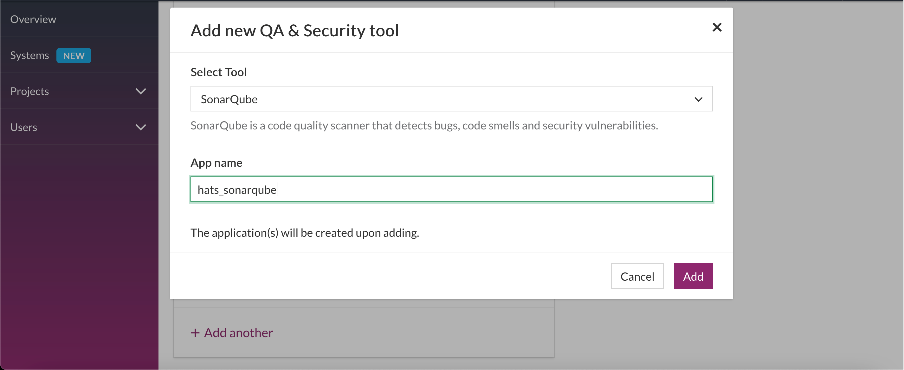

1.  In the **SonarQube** section, click **Manage**.

1.  Retrieve the **App Key** and **Token ID**.

    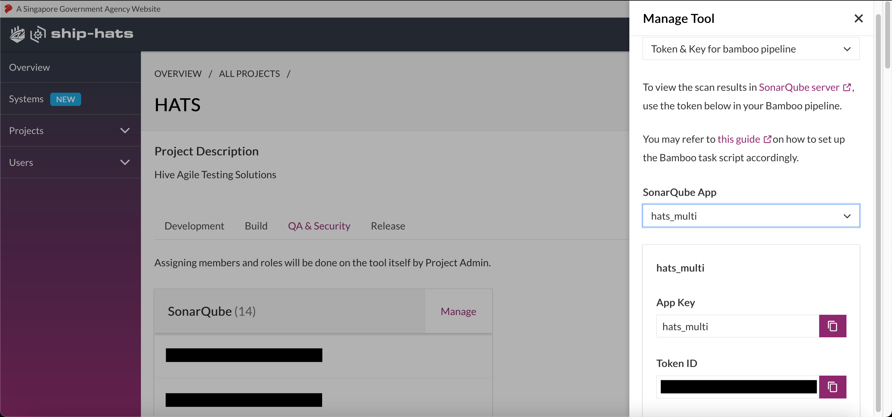

---
-->

## Configure Bamboo plan

**Topics**
- [Configure Repositories (Bitbucket)](#configure-repositories-bitbucket)
- [Configure Variables](#configure-variables)
- [Configure Requirements](#configure-requirements)
- [Configure Tasks](#configure-tasks)
- [Configure Branches (Optional)](#configure-branches)

### Configure repositories (Bitbucket)

1.  Sample repository from Bitbucket. We will run the SonarQube scan on both **develop** and **master** branch.

    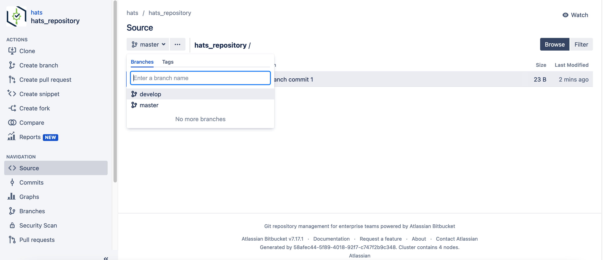

1.  In **Plan configuration**, click **Repositories**, and then click **Add repository**.
    
    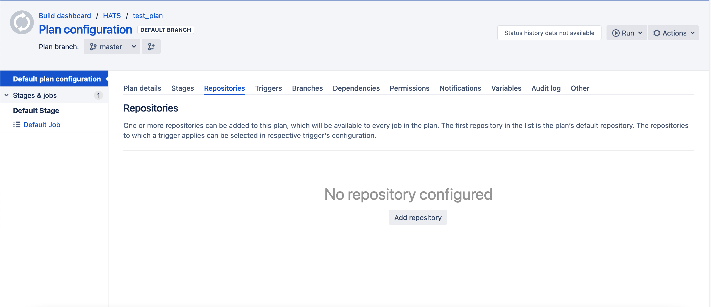

1.  Select **Bitbucket Server / Stash**.
    
    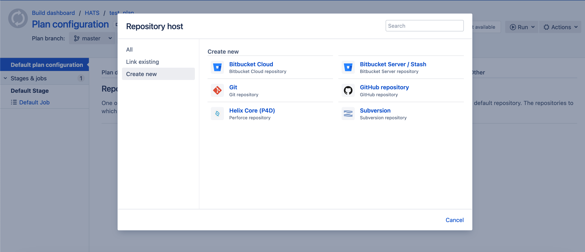

1.  In **Repository**, enter repository name, and then select the **master** branch. The name choice is up to you.
    
    

### Configure variables

1.  In **Plan configuration**, click **Variables**.
1.  Add a variable ending with *secret* (for example **sonarqube_token_secret**).
1. In **Value**, enter the
    **Token ID** obtained in step 5 in the [To Retrieve App Key and Token ID](#to-retrieve-app-key-and-token-id) section. 

    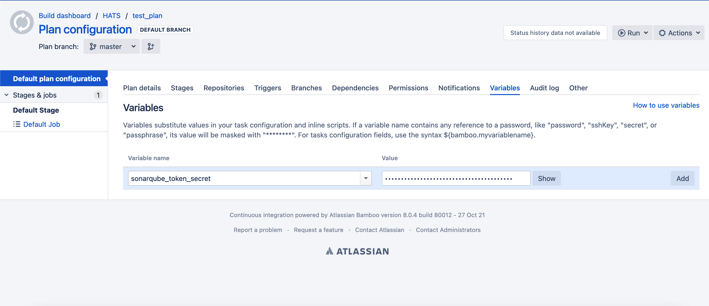

### Configure requirements

1.  In job configuration, in **Search for a capability**, add the necessary capability, and then select **Add**. For example:
    - For Linux, add **hats_linux_image** to exists.

        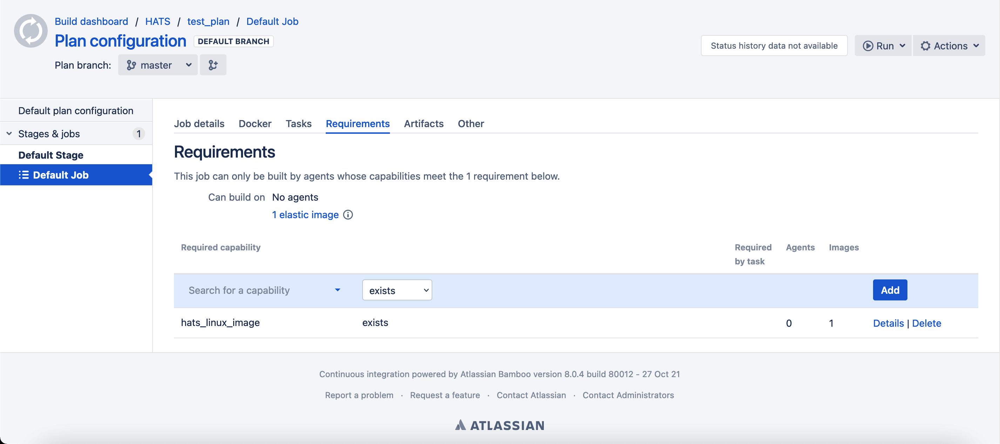
    - For Windows, add **hats_windows_image** to exists.

        

1.  If the screen shows **No Agents**, create a ticket to request for HATS Linux or Windows Agent to be dedicated to the Bamboo Project or a specific plan.

### Configure tasks

>**Note:** Do **not** use Sonar Plugin on  Bamboo. Use **Script**.

1.  In the job configuration, click **Tasks**, and then click **Add task**. 

    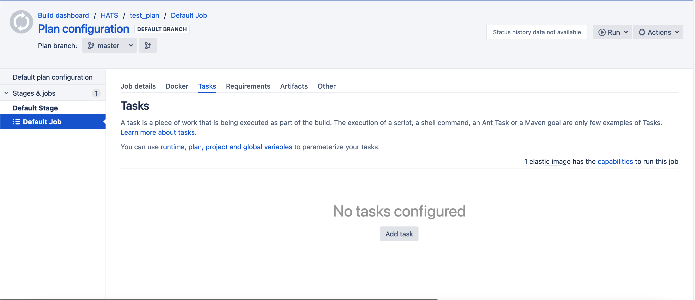

1.  Search for *source code checkout*, and then click **Source Code Checkout**.

    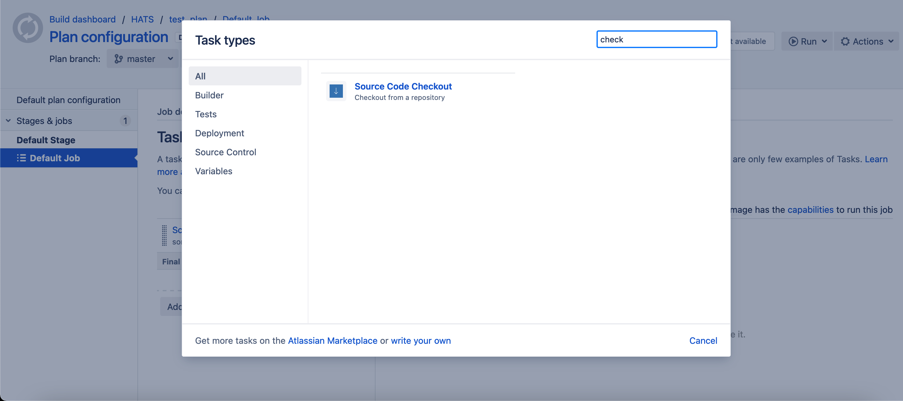

1.  Dropdown and select the repository configured in the [Configure Repositories](#configure-repositories-bitbucket) section. 
1. Select the **Force Clean Build** check box.

    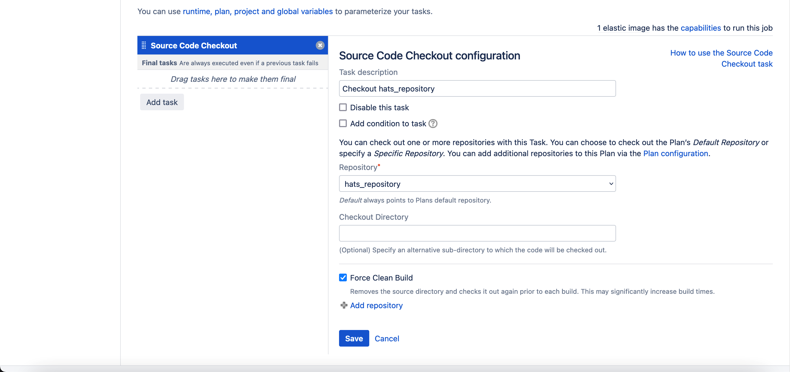

1.  Click **Add Task** again, search for *script*, and then click **Script**.

    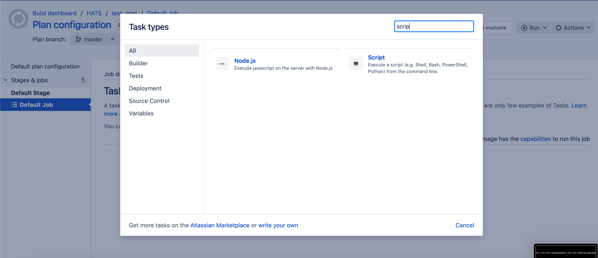

1.  Ensure the **Script** task is placed below the **Source Code Checkout** task.

1. In the description of **Tasks**, click *runtime, plan, project and global variables*. 

    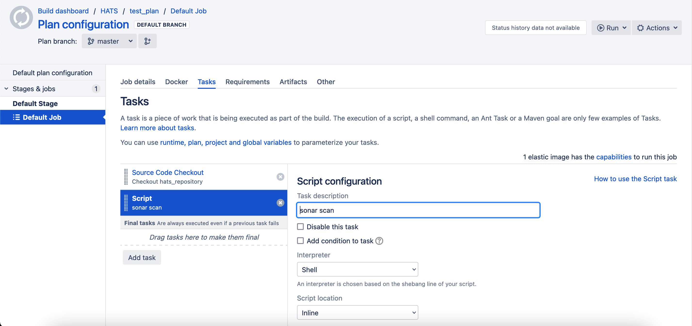

1.  In the new window that appears, scroll down till you see **Plan variables** where you will find the token you configured in the [Configure Variables](#configure-variables) section. 
1. Copy the value from **Variable name**.
    
    

1.  Copy the sona scan script based on the language of your repository (Refer to samples in the [Sona Scan for different languages](#sonar-scan-for-different-languages) section below), and replace **Variable name** as the value of `-Dsonar.login=`

    >**Note:** Do **not** store the token as plaintext in the script.

    In the Developer version:
    - An extra parameter `-Dsonar.branch.name` is available.
    - The URL is https://sonar1.hats.stack.gov.sg/sonar instead of https://sonar.hats.stack.gov.sg/sonar

    <br> 

    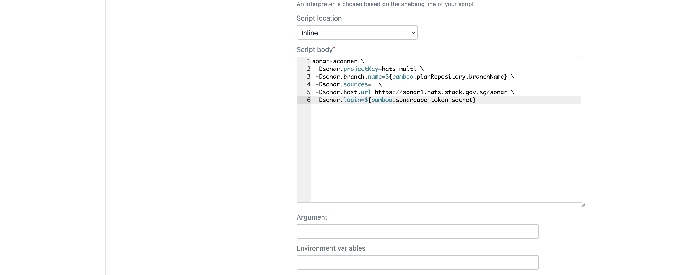

    >**Using variables in bash**
    >-   Bamboo variables are exported as bash shell variables. All full stops (periods) are converted to underscores.
    >-   For example, the variable `bamboo.my.variable` is `$bamboo_my_variable` in bash. This is related to File Script tasks (not Inline Script tasks).

### Configure branches

This is an optional step.

1. In **Plan configuration**, click **Branches**, and then click **Create plan branch**.

    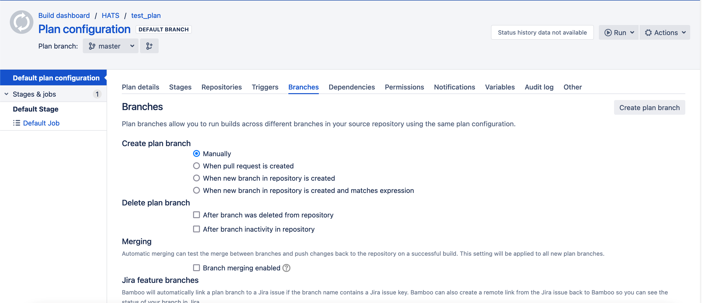

1. Add the branch name in the repository that you created in step 1 in the [Configure Repository](#configure-repositories-bitbucket) section, and then click **Create**.

    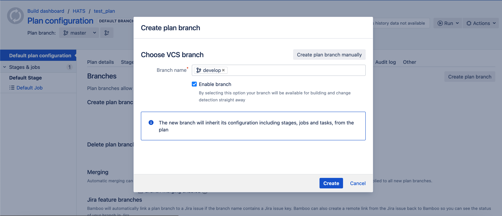

1. If the **Plan branch** does not switch to the new branch, click the dropdown to switch to the new branch. 

    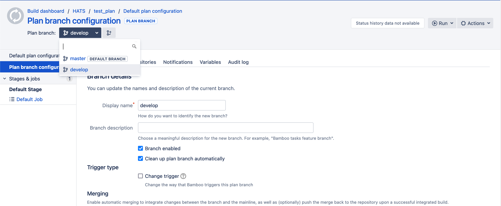

1. In the **Plan branch configuration**, click **Repositories**, and then click the repository created in step 4 in the [Configure Repository](#configure-repositories-bitbucket) section.

    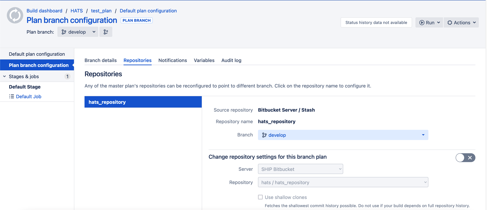

1. In the **Branch** field, click the dropdown and change to the newly created branch in step 2 in the [Configure Branches](#configure-branches) section.
1. Click **Save Repository**.


---

## Sonar scan for different languages

>**Note:** Remove the line `-Dsonar.branch.name=${bamboo.planRepository.branchName} \` if you are not using branch analysis.


**Topics**
- [Sonar Scan for Java](#sonar-scan-for-java)
- [Sonar Scan for MSBuild](#sonar-scan-for-msbuild)
- [Sonar Scan for Dotnet](#sonar-scan-for-dotnet)
- [Sonar Scan for Others](#sonar-scan-for-others)

>**Note:** In the updated SonarQube version 9.3, certain type of scans such as Maven or Ant might fail due to Java 11 needed to perform analysis as shown in the [SonarQube Moving Analysis to Java 11](https://docs.sonarqube.org/9.3/analysis/analysis-with-java-11/). For information on how to resolve this, refer to the [Using Java 11 in Sonar Scanner](#using-java-11-in-sonar-scanner) documentation.

### Sonar scan for Java

- **Maven**

    Format to put **Script body** in step 7 in the [Configure Tasks](#configure-tasks) section:

    <!-- tabs:start -->
    ### **Command Format**
    ```
        sonar-scanner \
        -Dsonar.projectKey=<App Key> \
        -Dsonar.branch.name=${bamboo.planRepository.branchName} \
        -Dsonar.sources=src/main/java \
        -Dsonar.java.binaries=target/classes \
        -Dsonar.language=java \
        -Dsonar.host.url=https://sonar.hats.stack.gov.sg/sonar \
        -Dsonar.login=<Token-from-SHIP-HATS-Portal>
    ```

    ### **Sample**
    ```
        sonar-scanner \
        -Dsonar.projectKey=hats_multi \
        -Dsonar.branch.name=${bamboo.planRepository.branchName} \
        -Dsonar.sources=src/main/java \
        -Dsonar.java.binaries=target/classes \
        -Dsonar.language=java \
        -Dsonar.host.url=https://sonar.hats.stack.gov.sg/sonar \
        -Dsonar.login=${bamboo.sonarqube_token_secret}
    ```
    <!-- tabs:end -->

- **Gradle**

    Current Sonarqube version : 9.3  
    Official documentation for the version 9.3
    <https://docs.sonarqube.org/9.3/analysis/scan/sonarscanner-for-gradle/>  

    1. Declare **org.sonarqube** plugin in **build.gradle** in your repository.

        <!-- tabs:start -->
        ### **Command Format**
         ```
        plugins {

        id "org.sonarqube" version "<version">

        }
        ```
        <!-- tabs:end -->

    1. Format to put **Script body** iin step 7 in the [Configure Tasks](#configure-tasks) section:
        
        <!-- tabs:start -->
        ### **Command Format**
        ```
        gradle sonarqube \
        -Dsonar.projectKey=<App Key> \
        -Dsonar.branch.name=${bamboo.planRepository.branchName} \
        -Dsonar.host.url=https://sonar.hats.stack.gov.sg/sonar \
        -Dsonar.login=<Token-from-SHIP-HATS-Portal>
        ```

        ### **Sample**

        ```
        gradle sonarqube \
        -Dsonar.projectKey=hats_multi \
        -Dsonar.branch.name=${bamboo.planRepository.branchName} \
        -Dsonar.host.url=https://sonar.hats.stack.gov.sg/sonar \
        -Dsonar.login=${bamboo.sonarqube_token_secret}
        ```
        <!-- tabs:end -->

### Sonar scan for MSBuild

1. Format to put **Script body** in step 7 in the [Configure Tasks](#configure-tasks) section:

    <!-- tabs:start -->

    ### **Command Format**

    ```
    # Start of scan

    sonar-scanner.bat -D"sonar.projectKey=<App Key from SHIP HATS self help portal>" -Dsonar.branch.name=${bamboo.planRepository.branchName} -D"sonar.sources=." -D"sonar.host.url=https://sonar.hats.stack.gov.sg/sonar" -D"sonar.login=<Token-from-SHIP-HATS-Portal>"

    # Rebuild your solution

    MSBuild.exe <path to solution.sln> /t:Rebuild

    # End of scan

    SonarScanner.MSBuild.exe end /d:sonar.login="<token>"
    ```

    <!-- tabs:end -->

### Sonar scan for Dotnet

1. Format to put **Script body** in step 7 in the [Configure Tasks](#configure-tasks) section:

    <!-- tabs:start -->

    ### **Command Format**

    ```
    # cd to the location where .csproj is located

    cd <path_to_csproj>

    # install dotnet-sonarscanner globally

    dotnet tool install --global dotnet-sonarscanner

    # begin sonar scan

    dotnet sonarscanner begin /k:$<App Key> /d:sonar.host.url=https://sonar.hats.stack.gov.sg/sonar  /d:sonar.login=<Token-from-SHIP-HATS-Portal>

    # build project

    dotnet build

    # end sonar scan

    dotnet sonarscanner end /d:sonar.login=<Token-from-SHIP-HATS-Portal>
    ```

    ### **Sample**

    ```
    # cd to the location where .csproj is located

    cd sample/sonarqube-scanner-dotnet/sampledotnet6

    # install dotnet-sonarscanner globally

    dotnet tool install --global dotnet-sonarscanner

    # begin sonar scan

    dotnet sonarscanner begin /k:${bamboo.sonarqube.projectKey} /d:sonar.host.url=${bamboo.hats.sonarqube.url} /d:sonar.login=${bamboo.sonarqube_community_portal_token_secret}

    # build project

    dotnet build

    # end sonar scan

    dotnet sonarscanner end /d:sonar.login=${bamboo.sonarqube_community_portal_token_secret}
    ```

    <!-- tabs:end -->

### Sonar scan for others

1. For Typescript or projects requiring Node modules, add the following line before scan:

    <!-- tabs:start -->
    
    ### **Typescript**
    ```
    export NODE_PATH=${bamboo.hats.node_modules.path}
    ```

    <!-- tabs:end -->

1. Format to put **Script body** in step 7 in the [Configure Tasks](#configure-tasks) section:

    <!-- tabs:start -->
    
    ### **Command Format**

    ```
    sonar-scanner \
    -Dsonar.projectKey=\<App Key from SHIP HATS Portal\> \
    -Dsonar.branch.name=${bamboo.planRepository.branchName} \
    -Dsonar.sources=. \
    -Dsonar.host.url=https://sonar.hats.stack.gov.sg/sonar \
    -Dsonar.login=<Token-from-SHIP-HATS-Portal\>
    ```

    ### **Sample**

    ```
    sonar-scanner \
    -Dsonar.projectKey=hats_multi \
    -Dsonar.branch.name=${bamboo.planRepository.branchName} \
    -Dsonar.sources=. \
    -Dsonar.host.url=https://sonar.hats.stack.gov.sg/sonar \
    -Dsonar.login=${bamboo.sonarqube_token_secret}
    ```

    <!-- tabs:end -->
---

## Test coverage

By default, your unit test results are not visible in your
SonarQube app. For the unit test coverage to be visible in your SonarQube app, you will need to provide the report path to the test coverage artifacts.

-   As each project uses different testing frameworks with different supported report format. Please refer to official SonarQube documentation on the types of Test Coverage report path provided that suits your project requirements.

-   Official Documentation:
    <https://docs.sonarqube.org/9.3/analysis/coverage/>

-   In this example, we use Jest Testing Framework as an example.

### Jest (Javascript Testing Framework)

Jest provides a `jest.config.js` file for configuration. To pass test coverage information to SonarQube, you need to provide the valid report format artifacts.

1. Indicate **lcov**  under the **coverageReporters**  parameter to have Jest generate the **lcov.info** as part of the coverage report artifacts.
    - By default, the coverage reports are stored under the directory named `coverage` 
    - The report path will be `coverage/lcov.info` 
    <br>

    **Configurations for generating the required test coverage report format**

    - The directory where Jest should output its coverage files:

        ```coverageDirectory: 'coverage',```

    - A list of reporter names that Jest uses when writing coverage reports:

        ```coverageReporters: ['lcov', 'text', 'text-summary', 'json'],```
    

1. Format to put **Script body** in step 7 in the [Configure Tasks](#configure-tasks) section. Make sure that you indicate the coverage files with the **-Dsonar.javascript.lcov.reportPaths** option.

    <!-- tabs:start -->
    
    ### **Command Format**

    ```
    sonar-scanner \
    -Dsonar.projectKey=<App Key from SHIP HATS Portal\> \
    -Dsonar.branch.name=${bamboo.planRepository.branchName} \
    -Dsonar.sources=. \
    -Dsonar.host.url=https://sonar.hats.stack.gov.sg/sonar \
    -Dsonar.login=<Token-from-SHIP-HATS-Portal\> \
    -Dsonar.javascript.lcov.reportPaths=coverage/lcov.info
    ```

    ### **Sample**

    ```
    sonar-scanner \
    -Dsonar.projectKey=hats_multi \
    -Dsonar.branch.name=${bamboo.planRepository.branchName} \
    -Dsonar.sources=. \
    -Dsonar.host.url=https://sonar.hats.stack.gov.sg/sonar \
    -Dsonar.login=${bamboo.sonarqube_token_secret} \
    -Dsonar.javascript.lcov.reportPaths=coverage/lcov.info
    ```

    <!-- tabs:end -->

    


## Using Java 11 in sonar scanner

In the updated SonarQube version 9.3, certain type of scans such as Maven or Ant might fail due to Java 11 needed to perform analysis as shown in the [SonarQube Moving Analysis to Java 11](https://docs.sonarqube.org/9.3/analysis/analysis-with-java-11/).

To resolve this, add an additional line depending on the requirements or images used as shown in the [Configure Requirements](#configure-requirements) section. This additional line should be added just before the start of sonar scan as described in the [Set up Sonar Scan for Different Languages](#sonar-scan-for-different-languages) section.

### For requirements/images using hats_linux_image

<!-- tabs:start -->

### **Command Format**

```
export JAVA_HOME=${bamboo.hats.image.linux.correttojdk11.path}
or
export JAVA_HOME="/opt/amazon-corretto-11"
```

### **Sample**

```
export JAVA_HOME=${bamboo.hats.image.linux.correttojdk11.path}
 
cd sample/sonarqube-scanner-maven/maven-basic/
 
mvn clean package
 
mvn sonar:sonar \
    -Dsonar.projectKey=${bamboo.sonarqube.projectKey} \
    -Dsonar.host.url=${bamboo.hats.sonarqube.url} \
    -Dsonar.login=${bamboo.sonarqube_community_portal_token_secret} \
    -Dsonar.java.binaries=./target/classes
```

<!-- tabs:end -->

### For requirements/images using hats_windows_image

<!-- tabs:start -->

### **Command Format**

```
set JAVA_HOME=${bamboo.hats.image.windows.correttojdk11.path}
or
set JAVA_HOME="C:\opt\jdk-11-aws-corretto"
```

### **Sample**

```
set JAVA_HOME=${bamboo.hats.image.windows.correttojdk11.path}
 
cd sample/sonarqube-scanner-msbuild/CSharpProject/SomeConsoleApplication
 
SonarScanner.MSBuild.exe begin /k:${bamboo.sonarqube.projectKey} /d:sonar.host.url=${bamboo.hats.sonarqube.url}
/d:sonar.login=${bamboo.sonarqube_community_portal_token_secret}
 
MsBuild.exe /t:Rebuild
 
SonarScanner.MSBuild.exe end /d:sonar.login=${bamboo.sonarqube_community_portal_token_secret}
```

<!-- tabs:end -->

## Additional resources

- Bash script to check if scan passes quality gate: https://bitbucket.ship.gov.sg/projects/CLGLAB/repos/cicd-helper-scripts/browse/bash/sonarsource_sonarqube